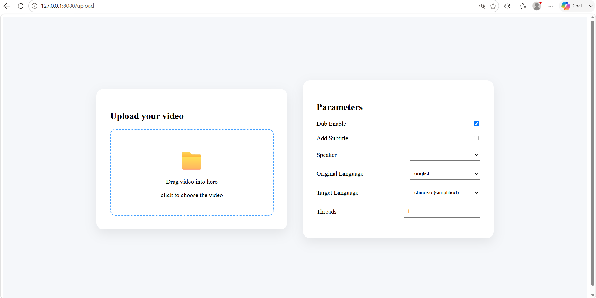
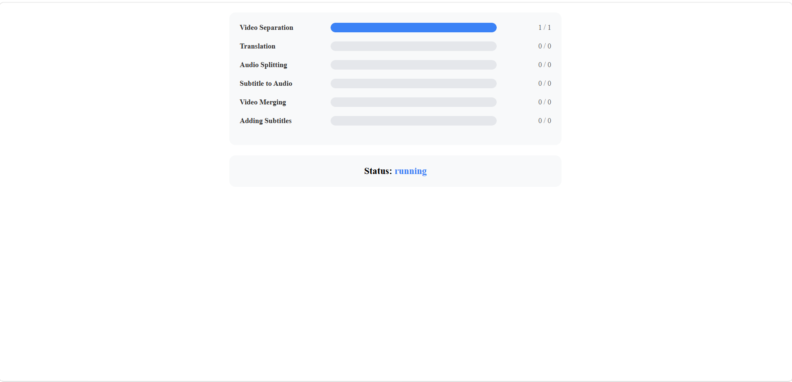
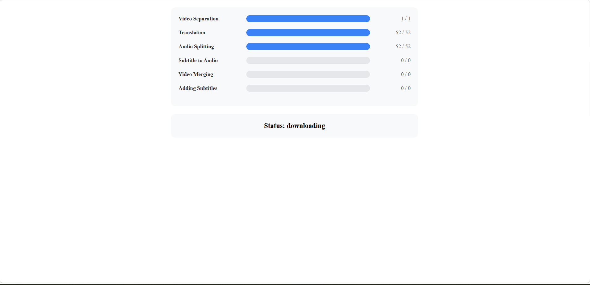

# AutoDub

**AutoDub** is an AI-powered video dubbing and localization tool.
It can translate videos into different languages, generate dubbed audio with customizable voices, and automatically create subtitles.


## Before Installation

We recommend creating a clean Python environment before installation.

AutoDub is developed and tested with **Python 3.10**.  
Please use **Python 3.10** to avoid potential dependency compatibility issues.


## Installation
### 1. Clone the repository

```bash
git clone https://github.com/shuyangzhangfirst/AutoDub.git
cd AutoDub
```

### 2. Install Python dependencies

First, install all required Python packages:

```bash
pip install -r requirements.txt
```

### 3. Install FFmpeg

This project requires **FFmpeg** for video and audio processing.

Please install FFmpeg and make sure it is available in your system PATH.


```bash
# on Ubuntu or Debian
sudo apt update && sudo apt install ffmpeg

# on Arch Linux
sudo pacman -S ffmpeg

# on MacOS using Homebrew (https://brew.sh/)
brew install ffmpeg

# on Windows using Chocolatey (https://chocolatey.org/)
choco install ffmpeg

# on Windows using Scoop (https://scoop.sh/)
scoop install ffmpeg


```
You can verify the installation by running:
```bash
ffmpeg -version
```

If the command prints the FFmpeg version information, the installation was successful.

## Usage

After installing all dependencies:

```bash
python main.py
```

The application will start the service and provide the web interface.
## Usage

### Main Interface



Configure the following parameters before starting the task:

### 1. Dub

Enable or disable AI dubbing for the output video.

### 2. Subtitles

Choose whether subtitles should be added to the output video.

### 3. Speaker

Select a voice from the **`speakers`** directory.

If you want to add your own voice, prepare the following files:

* A **WAV** file (5–10 seconds) containing a clear voice sample.
* A **TXT** file with the **same filename** as the WAV file. The TXT file must contain the exact transcript of the speech in the WAV file.

For example:

```
speakers/
├── shuyang.wav
└── shuyang.txt
```

**shuyang.wav**

> "How are you today? My name is Shuyang."

**shuyang.txt**

```
How are you today? My name is Shuyang.
```

Place both files in the **`speakers`** directory, and the speaker will appear in the speaker list.

If no speaker is selected, the program will automatically adapt the voice from the original video.

### 4. Original Language

Select the language spoken in the original video.

### 5. Target Language

Select the language you want to translate the video into.

### 6. Threads

Specify the number of worker threads.

Increasing the number of threads usually provides only a small performance improvement because most of the processing time is spent on AI model inference. Multi-threading mainly speeds up the translation stage, which sends requests to the Google Translate service.

### 7. Select a Video

Drag and drop a video into the upload area, or click the area to browse and select a video from your computer.

---

### Start Processing



After configuring all parameters, click **Start**.

You can monitor the progress while the video is being processed.

Processing time depends on:

* Video length
* Computer performance
* Whether this is the first time running the application

---

### First Launch



The first launch may take significantly longer because the required AI models will be downloaded automatically.

Please be patient during this process.

---

### Download the Result


When processing is complete, click **Download** to save the generated video.

The output video is also saved in the **`result`** directory.


## Features

* Translate videos into different languages
* Generate AI dubbing with selectable voices
* Automatically create subtitles
* Process video and audio files

## Requirements

* Python 3.10
* FFmpeg
* CUDA (recommended for GPU acceleration)
* A compatible NVIDIA GPU (recommended)

## Notes

The AI models are downloaded automatically when needed.
Please make sure you have enough disk space and a stable internet connection for the first run.


